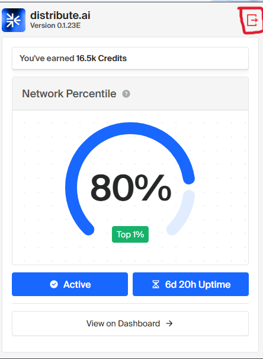
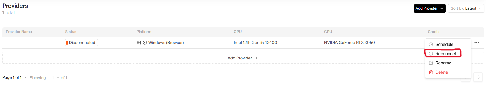
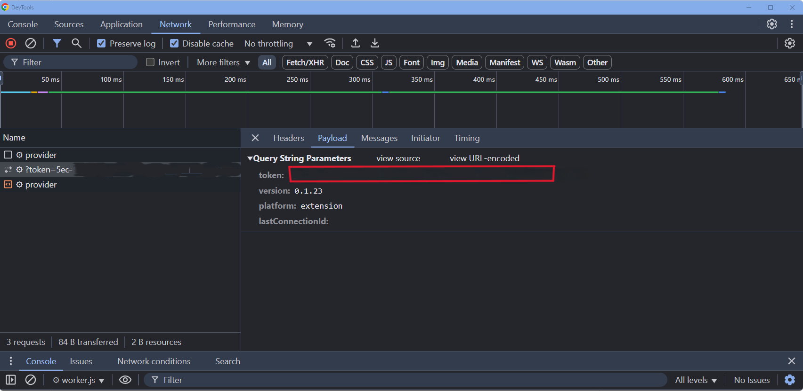

# GET TOKEN FROM



open your extension


go to chrome://extensions/ and find the extension and click service worker



go to https://dashboard.distribute.ai/provider/statistics



open the chrome the devtool from step devtools step 2 and copy the token value

# Proxy
proxy.txt format http://username:pass@ip:port use static
PROXY & TOKEN MUST SAME OR EQUAL IF U HAVE 5 TOKEN LIST THEN PROXY 5 LIST

# Usage
```sh
git clone https://github.com/sdssaeq/distribute.ai_bot.git
npm i
node index.js
```
